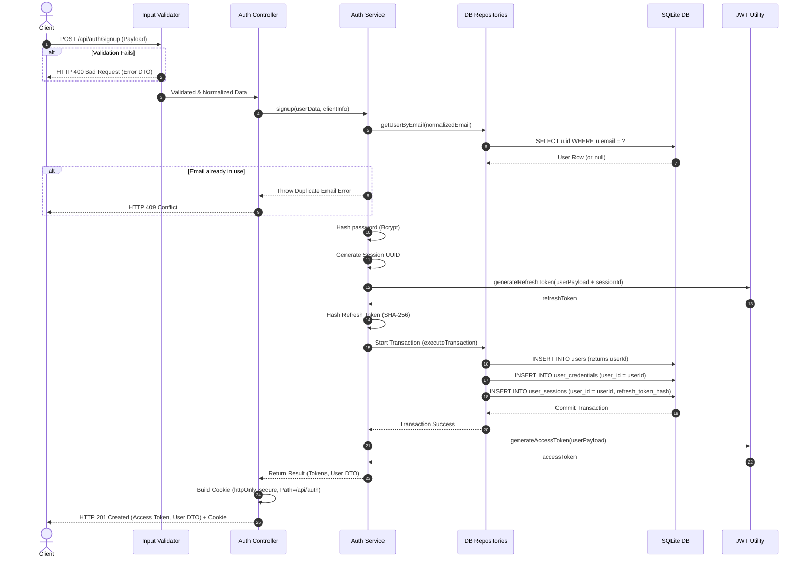

# API Specification Contract: POST /api/auth/signup (Frozen)

This document serves as the official API contract and source of truth for frontend client development, backend route handling, endpoint integration testing, and API documentation.

---

## 1. Endpoint
`POST /api/auth/signup`

---

## 2. Headers

### Required Headers
- **`Content-Type`**: `application/json` (Ensures payload is correctly parsed as JSON)

### Optional Headers
- **`User-Agent`**: Client browser/device identification string (used for session device logging)
- **`X-Forwarded-For`** / **`Remote-Addr`**: Client IP address (used for logging and fraud audit)

---

## 3. Request Body

| Field | Type | Required | Description | Example |
| :--- | :--- | :--- | :--- | :--- |
| **`name`** | String | Yes | Name of the registering customer. Min length 2, max 100. Supports international characters. | `"José O'Connor"` |
| **`email`** | String | Yes | Valid email address. Max length 254. RFC-compliant format. | `"jose@example.com"` |
| **`password`** | String | Yes | Plaintext registration password. Min length 8, max 128. Requires character complexity rules. | `"P@ssw0rdStrength!"` |

### JSON Payload Example
```json
{
  "name": "José O'Connor",
  "email": "jose@example.com",
  "password": "P@ssw0rdStrength!"
}
```

---

## 4. Normalization Rules

- **`email`**: Trim leading and trailing whitespace, then convert all characters to lowercase.
- **`name`**: Trim leading and trailing whitespace.
- **`password`**: Do NOT normalize. Passwords must preserve exact case and whitespace.

---

## 5. Validation Rules

- **`name`**:
  - **Minimum Length**: 2 characters.
  - **Maximum Length**: 100 characters.
  - **Character Support**: Rejects control characters. Fully supports international characters (e.g. Unicode, letters, spaces, hyphens, and apostrophes).
- **`email`**:
  - **Centralized Validation**: Validated using the centralized Email Utility.
  - **Maximum Length**: 254 characters (standard internet constraint).
- **`password`**:
  - **Minimum Length**: 8 characters.
  - **Maximum Length**: 128 characters.
  - **Complexity**: Must contain at least one uppercase letter (`[A-Z]`), one lowercase letter (`[a-z]`), one number (`[0-9]`), and one special character from the set `[!@#$%^&*(),.?":{}|<>~`_\-+=\[\]\\{}]`.

---

## 6. Business Rules

1. **Idempotency & Duplicate Email Check**: If a record with the normalized email already exists, signup fails with a `409 Conflict` error. If duplicate identical registration requests are received, only one account is created and subsequent requests receive `409 Conflict`, preventing duplicate customer creation.
2. **Provider Association**: A successful registration creates a credential entry under the `"email"` provider linked to the bcrypt password hash.
3. **Role Assignment**: Users created via the public signup route default to the `"customer"` role.
4. **Status Assignment**: User state defaults to `"active"`. A suspended or deleted user cannot create sessions.
5. **Email Verification**: User `email_verified` is initialized to `0` (false) upon profile creation.
6. **Session Creation**: Successful signup automatically logs the user in. A session record is registered inside the transaction, and the client receives cookies and tokens.

---

## 7. Success Response (HTTP 201 Created)

Returns the mapped User DTO, short-lived Access Token, and token lifespan metrics. The Refresh Token is returned exclusively in the response cookie.

```json
{
  "success": true,
  "message": "Account created successfully.",
  "data": {
    "user": {
      "public_id": "8a06e9f1-ca01-447a-8fbb-7ee96df58804",
      "name": "José O'Connor",
      "email": "jose@example.com",
      "role": "customer",
      "status": "active"
    },
    "accessToken": "eyJhbGciOiJIUzI1NiIsInR5cCI6IkpXVCJ9...",
    "expiresIn": 900
  },
  "meta": {
    "requestId": "req-9a7f23c0-41bf",
    "timestamp": "2026-07-05T21:22:31.000Z"
  }
}
```

---

## 8. Cookie Specification

The Refresh Token is assigned directly to client storage using a secure HttpOnly cookie.

| Attribute | Value | Reason |
| :--- | :--- | :--- |
| **Name** | `refreshToken` | Key identifier. |
| **HttpOnly** | `true` | Prevents access via client JavaScript, protecting against XSS attacks. |
| **Secure** | `true` (in Production) / `false` (in Development) | Enforces transmission only over encrypted HTTPS connections. |
| **SameSite** | `Lax` | Mitigates Cross-Site Request Forgery (CSRF). |
| **Path** | `/api/auth` | Restricts cookie visibility to authentication routes only, reducing credentials exposure. |
| **MaxAge** | `2592000` (30 days in seconds) | Valid lifespan of the refresh token. |
| **Domain** | Configured via environment variables | Limits cookie scope to specified subdomain/base domain. |

---

## 9. Error Responses

All error outputs adhere strictly to the standardized format:

```json
{
  "success": false,
  "message": "User-friendly description of the error.",
  "errorCode": "SPECIFIC_ERROR_CODE",
  "details": null
}
```

- **HTTP 400 Bad Request** (`WEAK_PASSWORD` / `INVALID_INPUT`): Triggered by validation failures, missing parameters, or password policy check violations.
- **HTTP 401 Unauthorized** (`UNAUTHORIZED`): Triggered when requests fail identity assertion.
- **HTTP 403 Forbidden** (`FORBIDDEN`): Triggered when request identity lacks required permissions.
- **HTTP 409 Conflict** (`DUPLICATE_EMAIL`): Triggered when the normalized email is already linked to an existing profile.
- **HTTP 500 Internal Server Error** (`INTERNAL_SERVER_ERROR`): Triggered by unexpected database failures, server crashes, or network disconnects.

---

## 10. User DTO (Data Transfer Object)

The response `user` DTO object only exposes public-facing profile properties:
- **`public_id`**: Public UUID string (never expose the internal SQLite integer primary key `id`).
- **`name`**: Trimmed display name.
- **`email`**: User email address.
- **`role`**: Client access tier (defaults to `"customer"`).
- **`status`**: Account status (defaults to `"active"`).

Exposing structural password hashes (`password_hash`), OAuth tokens, session hashes, internal sequence numbers, or provider identifiers is prohibited.

---

## 11. Security & Coding Guidelines

1. **Sensitive Data Lifetime**: Controllers and services must not retain references to `password`, `refreshToken`, or `passwordHash` in variables longer than required for validation, token signing, or response writing.
2. **Password Hashing**: Passwords must be hashed asynchronously using bcrypt with a work factor (salt rounds) of 12 before writing to persistent storage. Raw passwords must never be stored.
3. **Timing Attack Protection**: Signup workflows should maintain roughly uniform execution timing. An email verification check should not return significantly faster than a successful write sequence.
4. **Session Revocation**: A refresh token is hashed with SHA-256 before database insertion. Compromise of the database does not allow session spoofing.
5. **No Token Exposure in Logs**: Structured server-side logging must redact headers, plain passwords, bcrypt hashes, access JWTs, and refresh JWTs.
6. **Future Rate Limiting Roadmap**: A rate limiting middleware will be introduced in future sprints to limit signups per-IP and per-Email to mitigate automated registration abuse.
7. **Request ID Logging**: Structured logging of authentication requests will include a unique correlation `requestId` for Success, Failure, and Duplicate Email events (without logging credentials/tokens).

---

## 12. Sequence Diagram



---

## 13. Service Responsibility Boundaries

- **Controller**:
  - Receives request.
  - Passes payload to Service.
  - Configures and assigns the HttpOnly refresh token cookie on path `/api/auth`.
  - Returns formatted HTTP responses.
- **Service**:
  - Normalizes fields.
  - Checks database business constraints (duplicates).
  - Performs bcrypt hashing.
  - Orchestrates database writes within transactional boundaries.
  - Handles token signing and maps User DTO results.
- **Repository**:
  - Handles database persistence logic only. Accepts transactional database context `tx`.
- **Utilities**:
  - Exposes generic, reusable functions (email checks, password strength policy validation, JWT methods).
